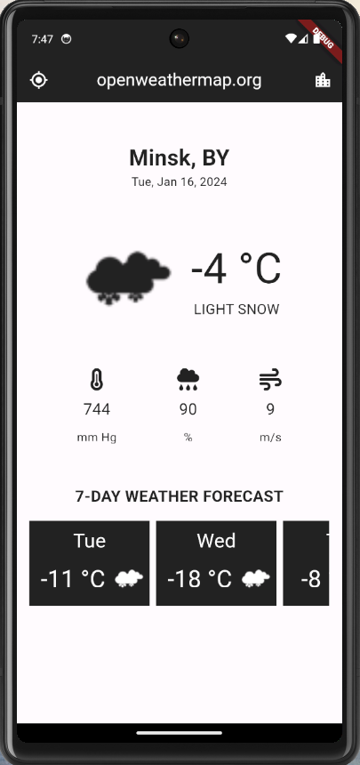

<h1>Weather App</h1>

<strong>Weather App</strong> - приложение для просмотра погоды на неделю по геолокации и названию города.

Используемые пакеты:
<ol>
<li><strong>http</strong> - пакет для отправки HTTP запросов и обработки HTTP ответов</li>
<li><strong>flutter_spinkit</strong> - коллекция индикаторов загрузки</li>
<li><strong>intl</strong> - пакет для форматирования и разбора дат и чисел</li>
<li><strong>font_awesome_flutter</strong> - пакет иконок</li>
<li><strong>geolocator</strong> - плагин геолокации</li>
</ol>
